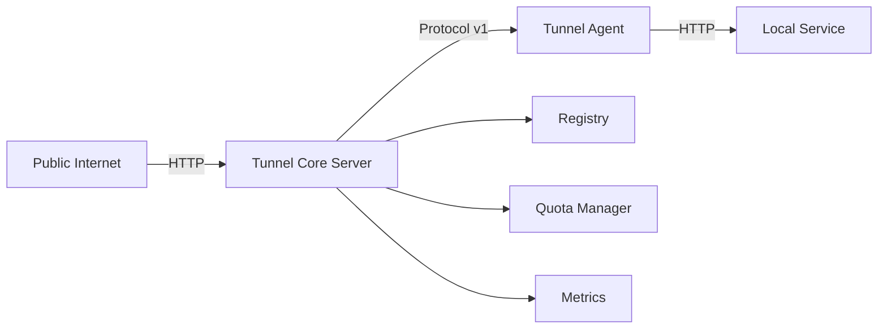

# Go-Tunnel

> Reverse tunnel system cho Go - Expose local services ra public internet

## Tính năng chính

- 🚀 **Stream Multiplexing** - Nhiều streams trên 1 connection
- 🔒 **TLS Security** - Mã hóa end-to-end
- 🎯 **Multi-tenant** - Hỗ trợ nhiều accounts với resource isolation
- 📊 **Monitoring** - Prometheus metrics và health checks
- ⚡ **High Performance** - Optimized cho low latency và high throughput
- 🐳 **Docker Ready** - Production-ready containers

## Kiến trúc



## Quick Start

### Sử dụng Docker

```bash
# Clone repository
git clone <repository-url>
cd Go-tunnel

# Start services
docker-compose up -d

# Test connection
curl http://localhost:8080/test
```

### Build từ source

```bash
# Build Core Server
cd tunnel-core
go build ./cmd/tunnel-server

# Build Agent
cd ../tunnel-agent
go build ./cmd/agent

# Run
./tunnel-server -agent-addr=:8443 -public-addr=:8080
./agent -server=localhost:8443 -token=test-token
```

## Documentation

Xem sidebar bên trái để tìm hiểu thêm về:

- **[Deployment](deployment.md)** - Hướng dẫn triển khai production
- **[Monitoring](monitoring.md)** - Setup monitoring và alerting
- **[Security](security.md)** - Best practices bảo mật
- **[API Reference](api.md)** - API documentation chi tiết

## Status

- ✅ Protocol v0.1.1 - Stable
- ✅ Core Server - Production ready
- ✅ Agent - Production ready
- ✅ Docker - Ready
- 📊 Monitoring - Comprehensive
- 🔒 Security - Best practices

**Production Readiness: 95%**

## Support

- 📖 **Documentation**: Xem các pages trong sidebar
- 🐛 **Issues**: Report bugs qua GitHub Issues
- 💬 **Discussion**: GitHub Discussions
- 📧 **Email**:dohuy8391@gmail.com

## License

See LICENSE file for details.
