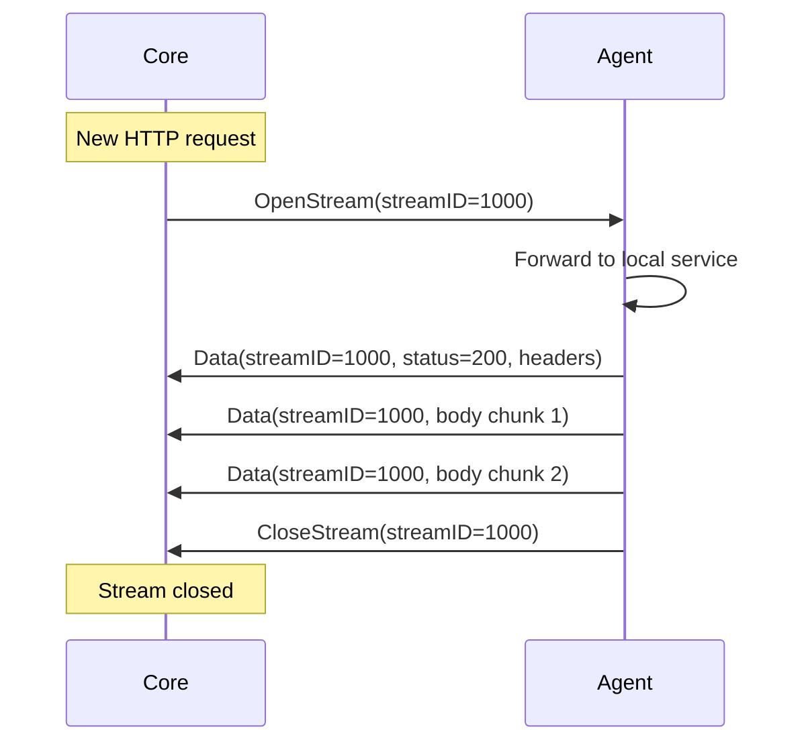
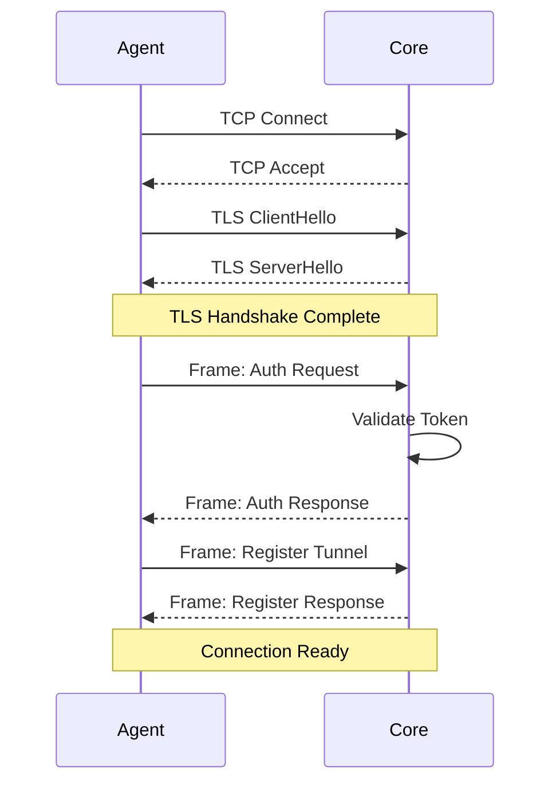
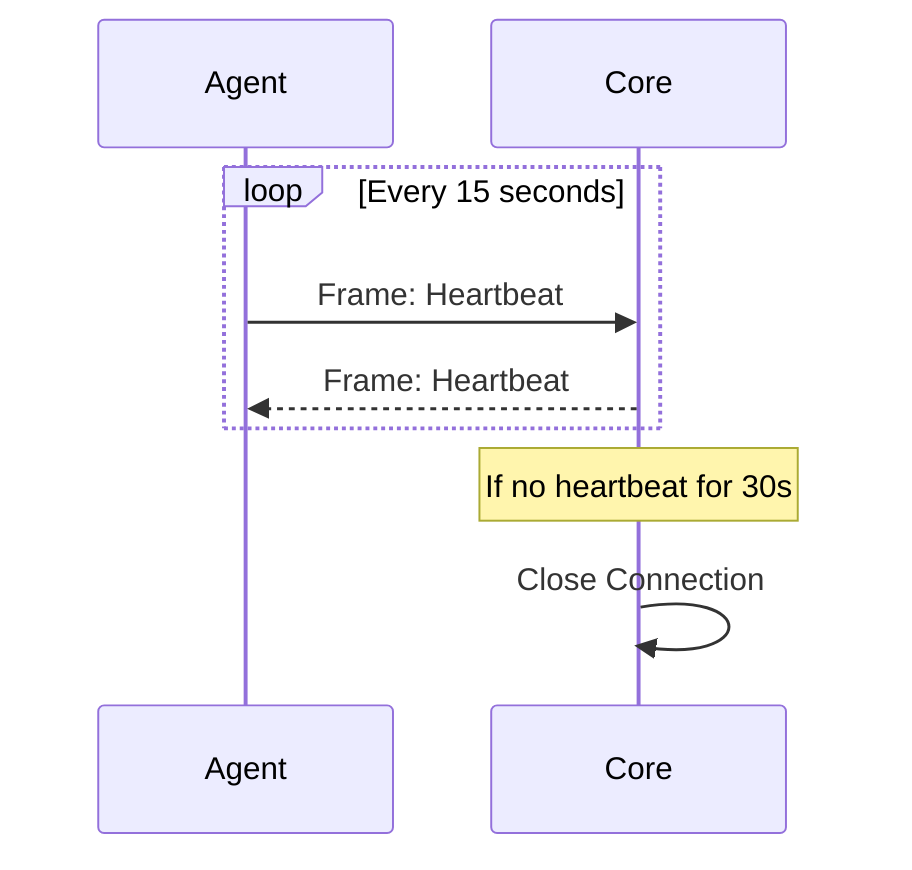
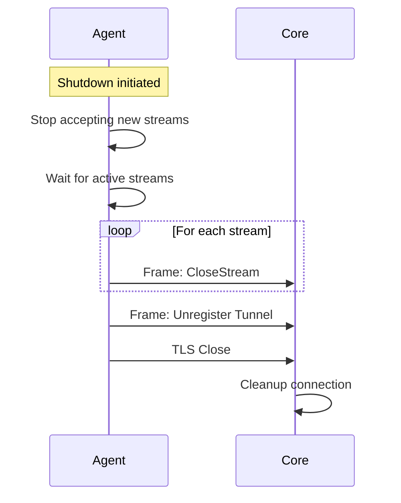

# API - Protocol Specification

Chi tiết về Tunnel Protocol v0.1.1.

## Overview

Tunnel Protocol là custom binary protocol cho communication giữa Agent và Core Server. Protocol được thiết kế cho:
- High performance
- Stream multiplexing
- Minimal overhead
- Easy debugging

## Frame Structure

### Binary Format

```
 0                   1                   2                   3
 0 1 2 3 4 5 6 7 8 9 0 1 2 3 4 5 6 7 8 9 0 1 2 3 4 5 6 7 8 9 0 1
+-+-+-+-+-+-+-+-+-+-+-+-+-+-+-+-+-+-+-+-+-+-+-+-+-+-+-+-+-+-+-+-+
|    Version    |     Type      |     Flags     |   Reserved    |
+-+-+-+-+-+-+-+-+-+-+-+-+-+-+-+-+-+-+-+-+-+-+-+-+-+-+-+-+-+-+-+-+
|                          Stream ID                            |
+-+-+-+-+-+-+-+-+-+-+-+-+-+-+-+-+-+-+-+-+-+-+-+-+-+-+-+-+-+-+-+-+
|                       Payload Length                          |
+-+-+-+-+-+-+-+-+-+-+-+-+-+-+-+-+-+-+-+-+-+-+-+-+-+-+-+-+-+-+-+-+
|                                                               |
+                         Payload Data                          +
|                        (variable length)                      |
+-+-+-+-+-+-+-+-+-+-+-+-+-+-+-+-+-+-+-+-+-+-+-+-+-+-+-+-+-+-+-+-+
```

### Field Descriptions

| Field | Size | Description |
|-------|------|-------------|
| Version | 1 byte | Protocol version (0x01) |
| Type | 1 byte | Frame type (see below) |
| Flags | 1 byte | Frame flags |
| Reserved | 1 byte | Reserved for future use (0x00) |
| Stream ID | 4 bytes | Stream identifier (big-endian) |
| Length | 4 bytes | Payload length in bytes (big-endian) |
| Payload | Variable | Frame-specific data |

**Total header size:** 12 bytes

## Frame Types

### Control Frames (Stream ID = 0)

#### 0x00 - Heartbeat

Keep-alive frame.

**Direction:** Bidirectional  
**Payload:** Empty

**Example:**
```
Version: 0x01
Type: 0x00
Flags: 0x00
Stream ID: 0x00000000
Length: 0x00000000
```

#### 0x01 - Auth Request

Agent authentication.

**Direction:** Agent → Core  
**Payload:** JSON

```json
{
  "version": "v0.1.1",
  "token": "base64-encoded-token",
  "agent_id": "my-agent",
  "metadata": {
    "hostname": "laptop",
    "os": "linux",
    "version": "1.0.0"
  }
}
```

#### 0x02 - Auth Response

Authentication result.

**Direction:** Core → Agent  
**Payload:** JSON

```json
{
  "success": true,
  "agent_id": "my-agent",
  "account_id": "acc-123",
  "conn_id": "conn-abc",
  "message": "Authentication successful"
}
```

**Error Response:**
```json
{
  "success": false,
  "error": "invalid_token",
  "message": "Authentication failed: invalid token"
}
```

#### 0x10 - Register Tunnel

Register subdomain mapping.

**Direction:** Agent → Core  
**Payload:** JSON

```json
{
  "subdomain": "myapp",
  "local_addr": "http://localhost:3000",
  "metadata": {
    "description": "My Application"
  }
}
```

**Response:**
```json
{
  "success": true,
  "subdomain": "myapp",
  "public_url": "http://myapp.tunnel.example.com"
}
```

#### 0x11 - Unregister Tunnel

Remove subdomain mapping.

**Direction:** Agent → Core  
**Payload:** JSON

```json
{
  "subdomain": "myapp"
}
```

### Data Frames

#### 0x20 - Open Stream

Initiate new HTTP request stream.

**Direction:** Core → Agent  
**Payload:** JSON

```json
{
  "stream_id": 12345,
  "method": "GET",
  "path": "/api/users",
  "headers": {
    "Host": "myapp.tunnel.com",
    "User-Agent": "curl/7.68.0",
    "Accept": "*/*"
  },
  "body": ""
}
```

**With body:**
```json
{
  "stream_id": 12346,
  "method": "POST",
  "path": "/api/users",
  "headers": {
    "Content-Type": "application/json",
    "Content-Length": "25"
  },
  "body": "{\"name\":\"John Doe\"}"
}
```

#### 0x21 - Data

HTTP response data.

**Direction:** Agent → Core  
**Payload:** JSON

```json
{
  "stream_id": 12345,
  "status": 200,
  "headers": {
    "Content-Type": "application/json",
    "Content-Length": "100"
  },
  "body": "{\"users\":[...]}"
}
```

**Chunked response:**
```json
{
  "stream_id": 12345,
  "status": 200,
  "headers": {
    "Transfer-Encoding": "chunked"
  },
  "body": "first chunk data",
  "more": true
}
```

#### 0x22 - Close Stream

End of stream.

**Direction:** Bidirectional  
**Payload:** JSON

```json
{
  "stream_id": 12345,
  "reason": "complete"
}
```

**Error close:**
```json
{
  "stream_id": 12345,
  "reason": "error",
  "error": "timeout",
  "message": "Request timeout"
}
```

### Error Frames

#### 0xFF - Error

Generic error message.

**Direction:** Bidirectional  
**Payload:** JSON

```json
{
  "code": "rate_limit_exceeded",
  "message": "Rate limit exceeded: 1000 req/s",
  "details": {
    "limit": 1000,
    "current": 1024
  }
}
```

## Stream Management

### Stream IDs

- **Stream ID 0:** Reserved for control frames
- **Stream ID 1-999:** Reserved for system use
- **Stream ID 1000+:** Application streams

**Client-initiated:**
- Odd numbers (1001, 1003, 1005, ...)

**Server-initiated:**
- Even numbers (1000, 1002, 1004, ...)

### Stream Lifecycle



### Stream States

```
IDLE → OPEN → HALF_CLOSED → CLOSED
         ↓
       ERROR
```

- **IDLE:** Stream not yet created
- **OPEN:** Active stream, data flowing
- **HALF_CLOSED:** One side finished sending
- **CLOSED:** Stream completely closed
- **ERROR:** Stream encountered error

## Connection Lifecycle

### 1. Connection Establishment



### 2. Keep-Alive



### 3. Graceful Shutdown



## Error Handling

### Error Codes

| Code | Description |
|------|-------------|
| `invalid_token` | Authentication failed |
| `invalid_frame` | Malformed frame |
| `rate_limit_exceeded` | Too many requests |
| `quota_exceeded` | Quota limit reached |
| `stream_not_found` | Invalid stream ID |
| `connection_closed` | Connection terminated |
| `timeout` | Request timeout |
| `internal_error` | Server error |

### Error Response Example

```json
{
  "code": "rate_limit_exceeded",
  "message": "Too many requests",
  "retry_after": 60,
  "details": {
    "limit": 1000,
    "window": "1m",
    "reset_at": "2024-02-09T10:30:00Z"
  }
}
```

## Implementation Notes

### Encoding/Decoding

**Go Implementation:**
```go
import "github.com/hydragon2m/tunnel-protocol/go/v1"

// Encode frame
frame := &v1.Frame{
    Version:  v1.Version,
    Type:     v1.FrameHeartbeat,
    Flags:    v1.FlagNone,
    StreamID: v1.StreamIDControl,
    Payload:  nil,
}
err := v1.Encode(conn, frame)

// Decode frame
frame, err := v1.Decode(conn)
```

### Performance Tips

1. **Buffer pooling:**
```go
var bufferPool = sync.Pool{
    New: func() interface{} {
        return make([]byte, 32*1024)
    },
}
```

2. **Reuse connections:**
- Don't create new connection per request
- Use stream multiplexing

3. **Limit payload size:**
- Max frame size: 16MB
- Use chunking for large data

## Versioning

- **Current version:** v0.1.1
- **Version byte:** 0x01

### Version Compatibility

| Client | Server | Compatible |
|--------|--------|------------|
| v0.1.x | v0.1.x | ✅ |
| v0.1.x | v0.2.x | ⚠️  (degraded) |
| v0.2.x | v0.1.x | ❌ |

### Migration

When upgrading:
1. Upgrade Core servers first
2. Gracefully drain old agents
3. Deploy new agents
4. Remove old agents

---

**See also:**
- [Architecture](architecture.md)
- [Development Setup](dev-setup.md)
