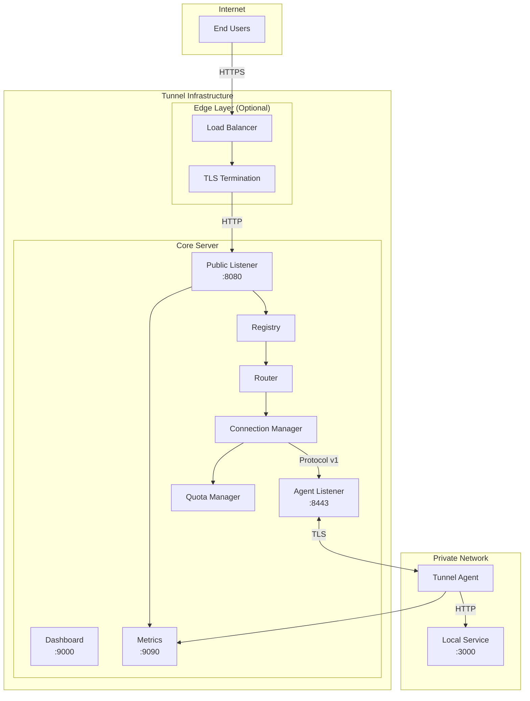
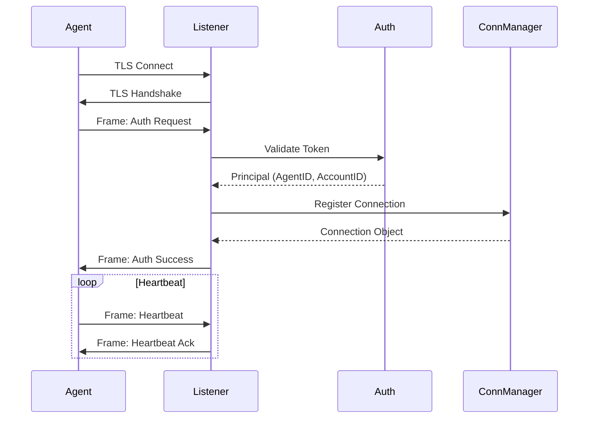
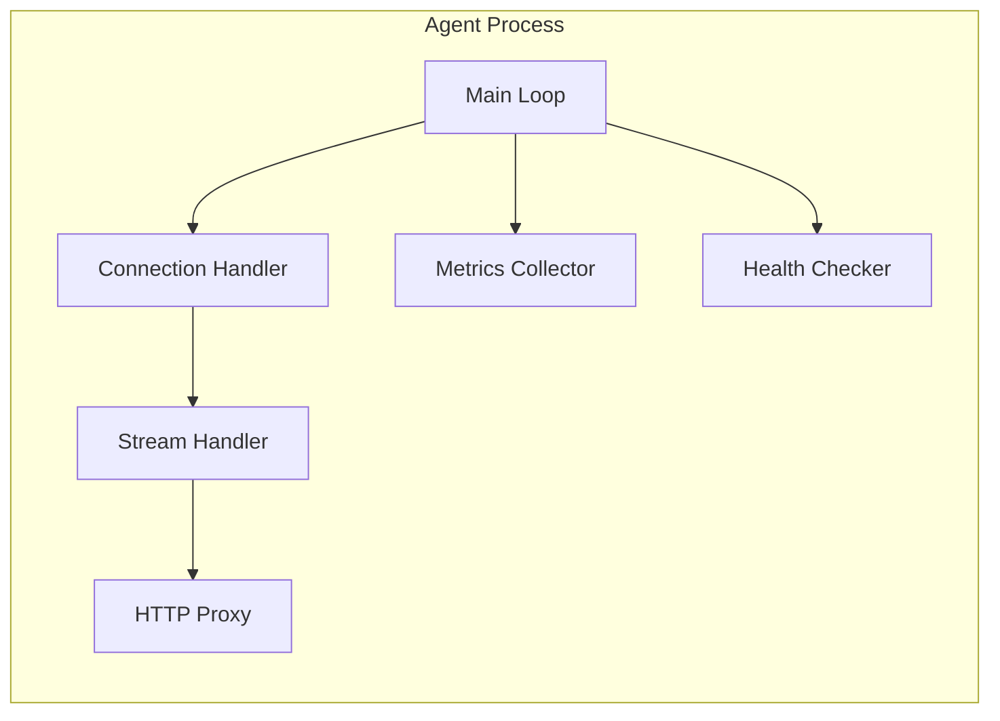
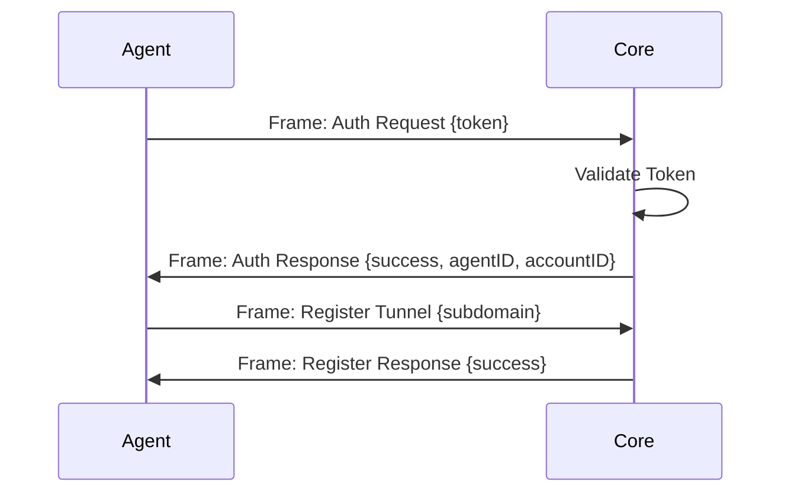
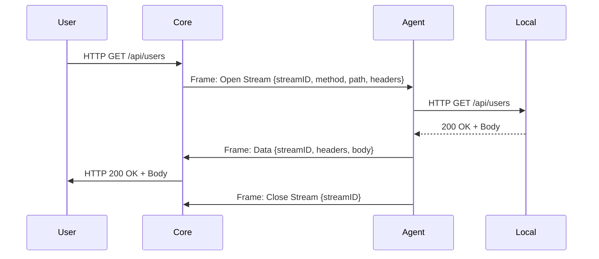
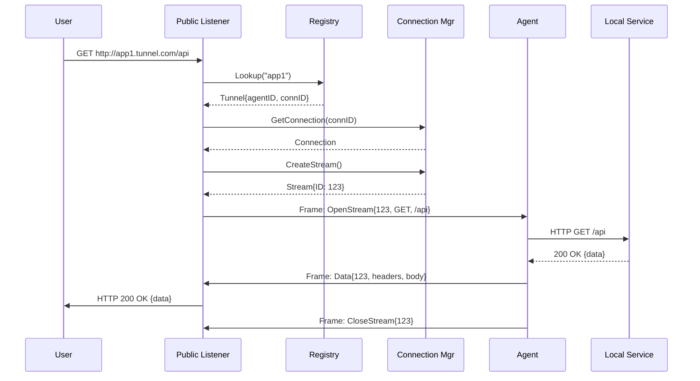
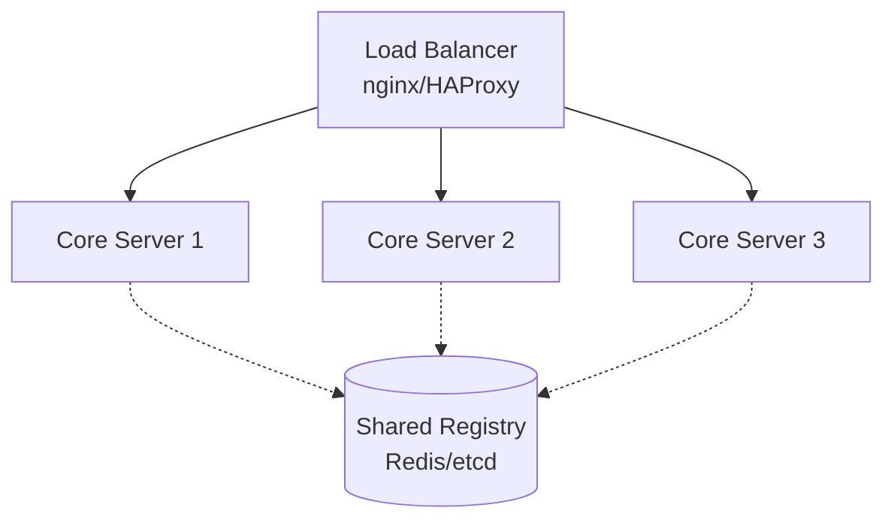
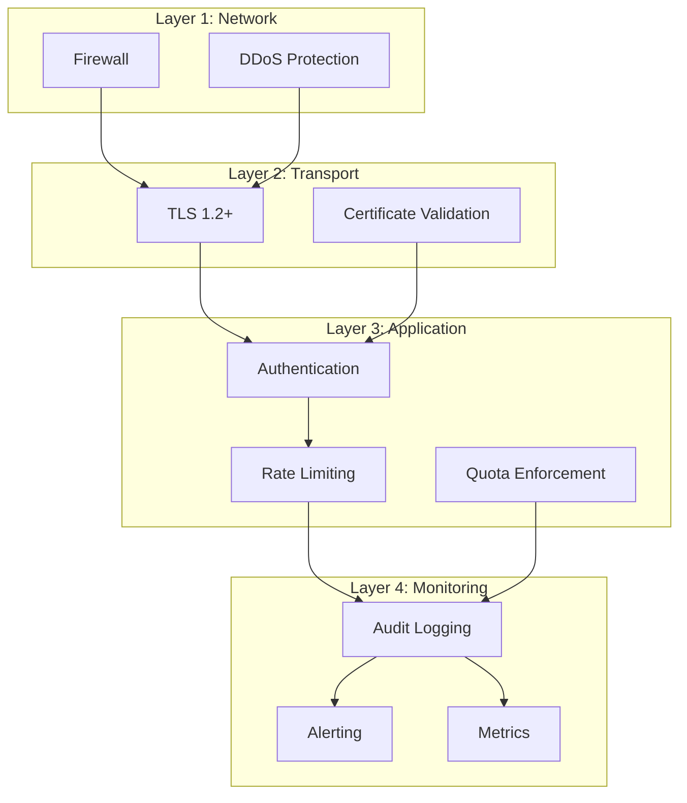

# Kiến trúc Go-Tunnel

Chi tiết về kiến trúc và thiết kế của hệ thống Go-Tunnel.

## Tổng quan High-Level



## Components Chi tiết

### 1. Tunnel Core Server

Server trung tâm nhận connections và route traffic.

#### 1.1 Public Listener

**Port:** 8080 (configurable)  
**Protocol:** HTTP/1.1, HTTP/2

**Responsibilities:**
- Accept incoming HTTP requests từ end users
- Extract Host header để xác định target tunnel
- Lookup tunnel trong Registry
- Route request đến appropriate agent connection
- Return response từ agent

**Flow:**
```
HTTP Request → Extract Host → Lookup in Registry → Get Connection → 
Create Stream → Send to Agent → Wait for Response → Return to User
```

#### 1.2 Agent Listener

**Port:** 8443 (configurable)  
**Protocol:** Custom tunnel protocol over TLS

**Responsibilities:**
- Accept persistent connections từ agents
- Perform TLS handshake
- Authenticate agents (token/JWT)
- Maintain connection pool
- Handle control frames (heartbeat, auth, close)
- Multiplex streams over single connection

**Connection Lifecycle:**


#### 1.3 Registry

**Purpose:** Map domains/subdomains đến agent connections

**Data Structure:**
```go
type Registry struct {
    tunnels map[string]*Tunnel  // subdomain -> tunnel
    mu      sync.RWMutex
}

type Tunnel struct {
    Subdomain   string
    AgentID     string
    AccountID   string
    LocalAddr   string
    CreatedAt   time.Time
}
```

**Operations:**
- `RegisterTunnel(subdomain, agentID, accountID, localAddr)`
- `UnregisterTunnel(subdomain)`
- `LookupTunnel(host) -> Tunnel`
- `GetTunnelsByAgent(agentID) -> []Tunnel`
- `GetTunnelsByAccount(accountID) -> []Tunnel`

#### 1.4 Connection Manager

**Purpose:** Quản lý tất cả agent connections và streams

**Key Structures:**
```go
type Manager struct {
    connections map[string]*Connection  // connID -> connection
    connsMu     sync.RWMutex
    
    // Per-account tracking
    accountConns map[string][]string    // accountID -> connIDs
    accountMu    sync.RWMutex
    
    // Limits
    maxConnections        int
    maxConnectionsPerAcct int
}

type Connection struct {
    ID              string
    AgentID         string
    AccountID       string
    RemoteAddr      string
    
    // Stream management
    streams         map[uint32]*Stream
    streamsMu       sync.RWMutex
    nextStreamID    uint32
    
    // Connection state
    ctx             context.Context
    cancel          context.CancelFunc
    LastHeartbeat   time.Time
}
```

**Features:**
- Connection pooling per account
- Stream multiplexing
- Graceful shutdown
- Heartbeat monitoring
- Resource limits enforcement

#### 1.5 Router

**Purpose:** Route HTTP requests đến đúng agent connection

**Algorithm:**
```
1. Extract Host header from request
2. Parse subdomain (e.g., "app1.tunnel.example.com" → "app1")
3. Lookup tunnel in Registry
4. Get connection from Connection Manager
5. Create new stream on connection
6. Send HTTP request through stream
7. Wait for response
8. Return response to client
```

**Error Handling:**
- 404: Tunnel not found
- 502: Agent not connected
- 504: Request timeout
- 429: Rate limit exceeded

#### 1.6 Quota Manager

**Purpose:** Enforce rate limits và quotas

**Limits:**
```go
type Limiter struct {
    connLimits  map[string]int      // accountID -> max connections
    reqLimiters map[string]*rate.Limiter  // accountID -> rate limiter
    bwLimiters  map[string]*BandwidthLimiter
}
```

**Enforced:**
- Max connections per account
- Requests per second
- Bandwidth limits
- Concurrent streams per connection

### 2. Tunnel Agent

Client chạy trong private network.

#### 2.1 Architecture



#### 2.2 Components

**Connection Handler:**
- Establish TLS connection to Core
- Send authentication frame
- Maintain persistent connection
- Handle reconnection với backoff
- Send heartbeats

**Stream Handler:**
- Receive stream open requests
- Create HTTP request từ stream data
- Forward request đến local service
- Stream response back to Core

**HTTP Proxy:**
- Parse incoming HTTP frames
- Construct http.Request
- Execute request đến local backend
- Stream response với chunked encoding

**Metrics Collector:**
- Request count
- Response times
- Error rates
- Connection status
- Export Prometheus metrics

### 3. Tunnel Protocol

Custom binary protocol cho agent-core communication.

#### 3.1 Frame Format

```
+---------------------------------------------------------------+
|  Version (1 byte) | Type (1 byte) | Flags (1 byte) | Reserved |
+---------------------------------------------------------------+
|                    Stream ID (4 bytes)                        |
+---------------------------------------------------------------+
|                    Length (4 bytes)                           |
+---------------------------------------------------------------+
|                    Payload (variable)                         |
+---------------------------------------------------------------+
```

**Fields:**
- **Version:** Protocol version (current: 0x01)
- **Type:** Frame type (see below)
- **Flags:** Frame flags
- **Stream ID:** Stream identifier (0 = control)
- **Length:** Payload length in bytes
- **Payload:** Frame-specific data

#### 3.2 Frame Types

| Type | Name | Description |
|------|------|-------------|
| 0x00 | Heartbeat | Keep-alive ping |
| 0x01 | Auth Request | Agent authentication |
| 0x02 | Auth Response | Auth result |
| 0x10 | Register Tunnel | Register subdomain |
| 0x11 | Unregister Tunnel | Remove subdomain |
| 0x20 | Open Stream | New HTTP request |
| 0x21 | Data | HTTP data chunk |
| 0x22 | Close Stream | End of stream |
| 0xFF | Error | Error message |

#### 3.3 Sequence Diagrams

**Authentication:**


**HTTP Request Flow:**


## Data Flow

### Request Flow (End-to-End)



## Scaling Strategy

### Vertical Scaling

**Single Core Server:**
- Tested: 10,000+ concurrent connections
- CPU: 4+ cores recommended
- RAM: 8GB+ for large deployments
- Network: 1Gbps+

### Horizontal Scaling

**Multiple Core Servers:**



**Requirements:**
- Shared registry (Redis/etcd)
- Session affinity ở load balancer
- Consistent hashing cho agent connections

## Security Architecture

### Defense in Depth



## Performance Considerations

### Bottlenecks

1. **Network I/O** - Primary bottleneck
2. **Memory** - Stream buffers
3. **CPU** - TLS encryption/decryption
4. **Locks** - Registry/connection map access

### Optimizations

1. **Stream Multiplexing** - Reuse connections
2. **Buffer Pooling** - sync.Pool for buffers
3. **Zero-copy** - io.ReaderFrom/WriterTo
4. **Lock-free paths** - RWMutex, atomic operations
5. **Connection pooling** - Reuse TCP connections

## Monitoring Points

### Core Server Metrics

- `tunnel_connections_total` - Total active connections
- `tunnel_connections_per_account` - Connections by account
- `tunnel_requests_total` - Request count
- `tunnel_request_duration_seconds` - Request latency
- `tunnel_streams_active` - Active streams
- `tunnel_registry_size` - Registered tunnels

### Agent Metrics

- `agent_connection_status` - Connection state
- `agent_requests_total` - Forwarded requests
- `agent_request_duration_seconds` - Local service latency
- `agent_errors_total` - Error count

---

## Next Steps

- **[Configuration](configuration.md)** - Customize settings
- **[API Protocol](api-protocol.md)** - Protocol details
- **[Performance Tuning](advanced-performance.md)** - Optimize performance
