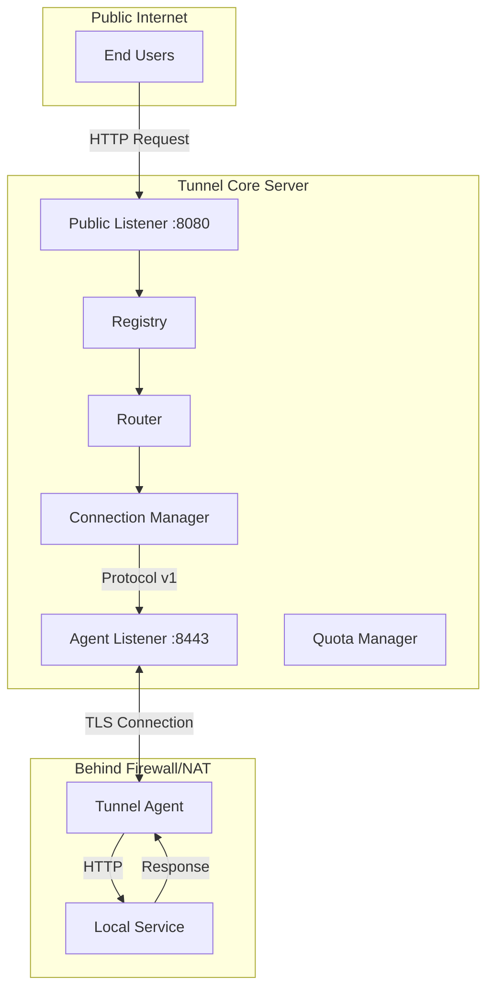

# Giới thiệu về Go-Tunnel

Go-Tunnel là một reverse tunnel system được viết bằng Go, cho phép bạn expose local services ra public internet một cách an toàn và hiệu quả.

## Tại sao chọn Go-Tunnel?

### 🚀 Performance

- **Stream Multiplexing**: Nhiều streams HTTP có thể chạy trên một TCP connection duy nhất
- **Zero Copy**: Tối ưu hóa memory với zero-copy streaming
- **Connection Pooling**: Tái sử dụng connections hiệu quả
- **Low Latency**: Được thiết kế cho real-time applications

### 🔒 Security

- **TLS 1.2+**: Mã hóa end-to-end cho tất cả connections
- **Token Authentication**: Xác thực agents an toàn
- **JWT Support**: Enterprise-grade authentication
- **Rate Limiting**: Bảo vệ khỏi DDoS attacks

### 📊 Observability

- **Prometheus Metrics**: Tích hợp sẵn metrics collection
- **Health Checks**: Multiple health check endpoints
- **Structured Logging**: JSON logs cho easy parsing
- **Distributed Tracing**: (Planned) OpenTelemetry support

### 🎯 Multi-Tenant

- **Account Isolation**: Mỗi account có resource pool riêng
- **Connection Limits**: Per-account connection limits
- **Quota Management**: Bandwidth và request quotas
- **Resource Tracking**: Chi tiết usage metrics per account

## Use Cases

### 1. Development & Testing
```bash
# Expose local dev server
./agent -server=tunnel.example.com:8443 \
        -token=dev-token \
        -local=http://localhost:3000
        
# Access via: https://myapp.tunnel.example.com
```

### 2. Webhooks
```bash
# Receive webhooks on local machine
./agent -server=tunnel.example.com:8443 \
        -token=webhook-token \
        -local=http://localhost:8080/webhooks
```

### 3. IoT Devices
```bash
# Expose device behind NAT/firewall
./agent -server=tunnel.example.com:8443 \
        -token=device-123 \
        -local=http://localhost:80
```

### 4. Internal Services
```bash
# Expose internal service temporarily
./agent -server=tunnel.example.com:8443 \
        -token=demo-token \
        -local=http://internal-api:8080
```

## Kiến trúc tổng quan



## Components

### Tunnel Core Server

Server trung tâm nhận connections từ agents và route incoming HTTP requests đến đúng agent.

**Trách nhiệm:**
- Accept persistent connections từ agents
- Quản lý domain → agent mapping trong Registry
- Route HTTP requests đến agent thích hợp
- Enforce quotas và rate limits
- Thu thập metrics và health data

### Tunnel Agent

Client chạy trên local machine hoặc trong private network, kết nối đến Core Server và forward requests đến local service.

**Trách nhiệm:**
- Maintain persistent connection với Core Server
- Authenticate với token/JWT
- Handle incoming requests từ Core
- Forward requests đến local service
- Report metrics và health status

### Tunnel Protocol

Protocol tùy chỉnh dựa trên frames để giao tiếp giữa Agent và Core.

**Features:**
- Frame-based protocol với length prefix
- Stream multiplexing
- Control frames (auth, heartbeat, close)
- Data frames cho HTTP traffic
- Backpressure support

## So sánh với alternatives

| Feature | Go-Tunnel | ngrok | Cloudflare Tunnel | SSH Tunnel |
|---------|-----------|-------|-------------------|------------|
| Open Source | ✅ | ❌ | ❌ | ✅ |
| Self-Hosted | ✅ | ❌ | ❌ | ✅ |
| Multi-Tenant | ✅ | ✅ | ✅ | ❌ |
| Stream Multiplexing | ✅ | ✅ | ✅ | ❌ |
| Prometheus Metrics | ✅ | ❌ | ❌ | ❌ |
| Custom Domains | ✅ | 💰 | ✅ | ✅ |
| TLS Termination | ✅ | ✅ | ✅ | ❌ |
| Rate Limiting | ✅ | 💰 | ✅ | ❌ |

**Legend:**
- ✅ Available
- ❌ Not available
- 💰 Paid feature only

## Khi nào nên dùng Go-Tunnel?

### ✅ Phù hợp khi:

- Bạn cần **self-hosted solution** với full control
- Cần **multi-tenant support** cho nhiều users/teams
- Cần **comprehensive monitoring** với Prometheus/Grafana
- Muốn **customize** và extend theo nhu cầu
- Có **enterprise requirements** về security và compliance
- Cần **high performance** cho production workloads

### ❌ Không phù hợp khi:

- Chỉ cần quick tunnel cho development (dùng ngrok free tier)
- Không có infrastructure để host (dùng managed service)
- Cần **zero configuration** setup (dùng Cloudflare Tunnel)
- Team nhỏ không có resources để maintain

## Next Steps

1. **[Quick Start](quickstart.md)** - Chạy Go-Tunnel trong 5 phút
2. **[Architecture](architecture.md)** - Hiểu rõ hơn về kiến trúc
3. **[Deployment](deployment.md)** - Deploy lên production
4. **[Security](security.md)** - Bảo mật deployment của bạn

## Community & Support

- 📖 **Documentation**: Bạn đang đọc đây
- 💬 **Discussions**: GitHub Discussions
- 🐛 **Issues**: GitHub Issues
- 📧 **Email**:dohuy8391@gmail.com
