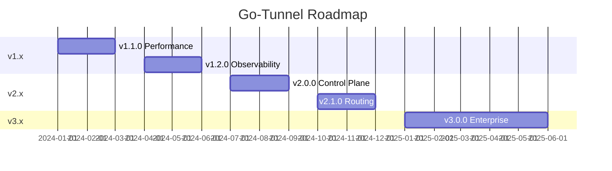

# Roadmap

Kế hoạch phát triển tương lai cho Go-Tunnel.

## Version 1.x - Production Enhancements

### v1.1.0 - Performance & Reliability (Q1 2024)

**Focus:** Production hardening và performance optimization

#### Features
- [ ] **Performance benchmarks**
  - Load testing framework
  - Benchmark suite
  - Performance regression tests
  - Documentation về performance characteristics

- [ ] **Connection pooling improvements**
  - Smarter connection reuse
  - Connection health checks
  - Automatic connection rotation

- [ ] **Enhanced monitoring**
  - Custom Grafana dashboards included
  - Pre-configured alert rules
  - SLI/SLO tracking
  - Error budget monitoring

- [ ] **Graceful upgrades**
  - Zero-downtime deployments
  - Rolling updates support
  - Connection draining improvements

#### Improvements
- Reduce memory overhead
- Optimize CPU usage
- Better error messages
- Improved logging correlation

### v1.2.0 - Observability (Q2 2024)

**Focus:** Distributed tracing và advanced debugging

#### Features
- [ ] **OpenTelemetry integration**
  - Distributed tracing
  - End-to-end request tracking
  - Trace correlation with logs
  - Jaeger/Tempo support

- [ ] **Advanced debugging**
  - Request replay capability
  - Traffic recording/playback
  - Debug mode với detailed logs
  - Connection state inspection

- [ ] **Enhanced metrics**
  - P50/P95/P99 latency metrics
  - Error rate tracking
  - Saturation metrics
  - Custom business metrics

#### Improvements
- Better observability docs
- Runbook templates
- Incident response guides

## Version 2.x - Control Plane

### v2.0.0 - Control Plane (Q3 2024)

**Focus:** Management API và automation

#### Features
- [ ] **REST Control Plane API**
  - Create/delete tunnels programmatically
  - Agent management
  - Quota management
  - Analytics API

- [ ] **Web UI**
  - Modern React dashboard
  - Tunnel management interface
  - Usage analytics
  - Account management

- [ ] **Multi-user support**
  - User authentication
  - Role-based access control (RBAC)
  - Team management
  - API keys per user

#### API Endpoints
```
POST   /api/v1/tunnels          # Create tunnel
GET    /api/v1/tunnels          # List tunnels
GET    /api/v1/tunnels/:id      # Get tunnel
DELETE /api/v1/tunnels/:id      # Delete tunnel
PATCH  /api/v1/tunnels/:id      # Update tunnel

POST   /api/v1/agents           # Register agent
GET    /api/v1/agents           # List agents
DELETE /api/v1/agents/:id       # Remove agent

GET    /api/v1/accounts/:id/usage   # Usage stats
POST   /api/v1/accounts/:id/quota   # Update quota
```

### v2.1.0 - Advanced Routing (Q4 2024)

**Focus:** Smart routing và load balancing

#### Features
- [ ] **Advanced routing**
  - Path-based routing
  - Header-based routing
  - Custom routing rules
  - Regex path matching

- [ ] **Load balancing**
  - Round-robin (current)
  - Least connections
  - Weighted routing
  - Sticky sessions

- [ ] **Traffic management**
  - Traffic splitting (A/B testing)
  - Canary deployments
  - Blue-green deployments
  - Circuit breaker

#### Example Config
```yaml
routes:
  - match:
      path: /api/*
      headers:
        X-API-Version: v2
    backend:
      - agent: api-v2
        weight: 80
      - agent: api-v1
        weight: 20
```

## Version 3.x - Enterprise Features

### v3.0.0 - Enterprise (2025)

**Focus:** Enterprise requirements

#### Features
- [ ] **Edge Layer**
  - Global edge network
  - Geographic routing
  - Smart DNS
  - CDN integration

- [ ] **Advanced security**
  - mTLS support
  - OAuth2/OIDC integration
  - IP allowlisting/blocklisting
  - WAF integration

- [ ] **Compliance**
  - Audit logging
  - Data retention policies
  - GDPR compliance tools
  - SOC2 requirements

- [ ] **High availability**
  - Multi-region deployment
  - Automatic failover
  - Cross-region replication
  - Disaster recovery

## Protocol Enhancements

### Protocol v2.0

**Planned improvements:**

- [ ] **WebSocket native support**
  - Direct WebSocket tunneling
  - Reduced overhead
  - Better for real-time apps

- [ ] **gRPC support**
  - Native gRPC tunneling
  - Bidirectional streaming
  - Protocol buffers support

- [ ] **QUIC/HTTP/3**
  - UDP-based transport
  - Improved performance
  - Better for mobile

- [ ] **Compression**
  - Built-in compression
  - Content-aware compression
  - Bandwidth optimization

## Community & Ecosystem

### Documentation
- [ ] Video tutorials
- [ ] Interactive examples
- [ ] Best practices guide
- [ ] Architecture decision records (ADRs)

### Integrations
- [ ] Terraform provider
- [ ] Kubernetes operator
- [ ] Helm charts
- [ ] Ansible playbooks

### CLI Improvements
- [ ] Interactive setup wizard
- [ ] Config file generator
- [ ] Health check CLI
- [ ] Log viewer/analyzer

## Research & Exploration

### Under Consideration

**Features being evaluated:**

- **Plugin system**
  - Custom authentication plugins
  - Custom routing plugins
  - Middleware support

- **Database backend**
  - Persistent tunnel registry
  - SQLite for single-node
  - PostgreSQL for multi-node

- **Service mesh integration**
  - Istio integration
  - Linkerd support
  - Consul Connect

- **eBPF acceleration**
  - Kernel-level packet processing
  - Ultra-low latency
  - Higher throughput

## Timeline



## How to Contribute

Muốn contribute vào roadmap?

1. **Propose features**
   - Open GitHub Discussion
   - Explain use case
   - Gather feedback

2. **Vote on features**
   - 👍 React on GitHub Issues
   - Comment với use cases
   - Help prioritize

3. **Implement features**
   - Pick from roadmap
   - Follow [Contributing Guide](contributing.md)
   - Submit PR

## Feature Requests

Top requested features (community voting):

| Feature | Votes | Status |
|---------|-------|--------|
| WebSocket support | 🔥🔥🔥🔥🔥 | Planned v3.0 |
| Web UI | 🔥🔥🔥🔥 | In progress v2.0 |
| gRPC tunneling | 🔥🔥🔥 | Planned v3.0 |
| Plugin system | 🔥🔥 | Research |
| Terraform provider | 🔥🔥 | Planned v2.1 |

**Want to vote?** Comment on [GitHub Discussions](https://github.com/hydragon2m/go-tunnel/discussions)

---

## Disclaimer

Roadmap có thể thay đổi dựa trên:
- Community feedback
- Technical constraints
- Resource availability
- Market conditions

**Not guaranteed!** Features và timelines có thể shift.

---

**Stay updated:**
- ⭐ Star the repo
- 👀 Watch releases
- 💬 Join discussions
- 📧 Newsletter (coming soon)
